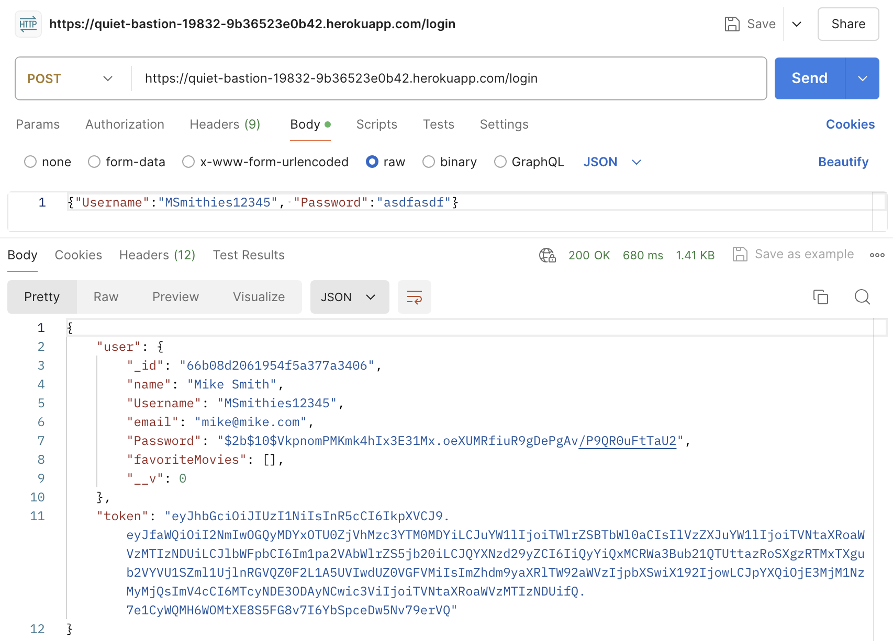
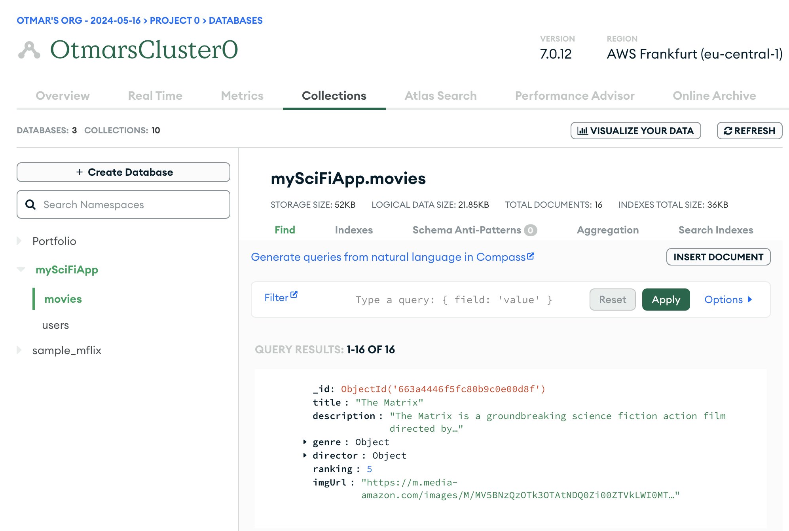
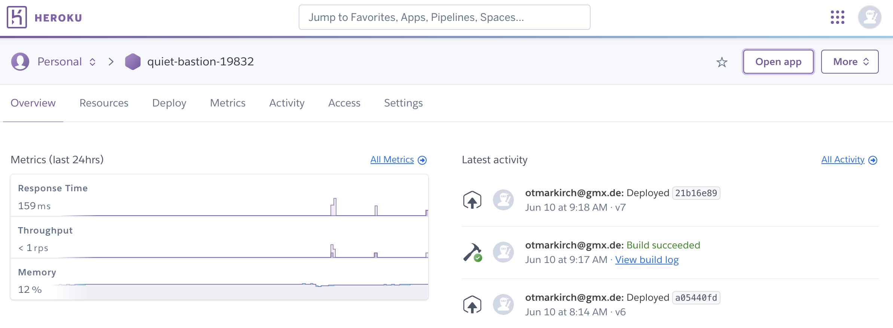

# sci-fi-app server

<!-- toc -->

  * [Description](#description)
  * [Technologies](#technologies)
  * [Setup](#setup)
  * [Key Features](#key-features)
  * [Impressions](#impressions)
  * [Conclusion](#conclusion)
    + [Challenges](#challenges)
    + [Future Improvements](#future-improvements)
  * [Final Thoughts](#final-thoughts)
- [Overview](#overview)
  * [The server](#the-server)
  * [The client](#the-client)

<!-- tocstop -->

## Description

A full-stack web application using the MERN (MongoDB, Express, React, and Node.js) stack is developed, demonstrating comprehensive skills in full-stack JavaScript development.

The client side code of this project is implemented in two other repositories: as a [React app](https://github.com/OtmarKirch/MySciFi-client) and as an [Angular app](https://github.com/OtmarKirch/mySciFi-Angular-client). You can find the React app running on [netlifly](https://myscifiapp.netlify.app/) and the Angular app on [GitHub Pages](https://otmarkirch.github.io/mySciFi-Angular-client/).

## Technologies
- Node.js
- Express
- MongoDB
- Mongoose
- JWT (JSON Web Tokens)

## Setup
### Hosted at Heroku

The server is running on Heroku. The root endpoint can be accessed at
https://quiet-bastion-19832-9b36523e0b42.herokuapp.com/

The full API documentation on how to access all public endpoints via API's can be accessed at  
https://quiet-bastion-19832-9b36523e0b42.herokuapp.com/documentation.html

### Local Setup

#### Database at MongoDB Atlas
In order to run the server, a database has to be established at MongoDB Atlas. The connection string can be obtained from the MongoDB Atlas dashboard and has to be stored in an `.env` file ([see below](#codebase)).
The database has to be populated with movie data. This has to be formatted as JSON and can be imported via the MongoDB Atlas dashboard. Movies have to follow the schema as defined in [`models.js`](https://github.com/OtmarKirch/sci-fi-app/blob/main/models.js#L4) in the codebase.

#### Codebase
The server can be run locally by cloning the repository. 
In order to connect to the database, the connection string obtained from Atlas has to be stored in a `.env` file in the root directory of the project. The `.env` file should look like this:

````
DB_CONNECTION_URI="YOUR_CONNECTION"
````
Replace `YOUR_CONNECTION` with the connection string obtained from MongoDB Atlas.

In order to run the server execute the following commands in the root directory of the project:

````
node index.js
````

## Key Features

## Impressions
### Testing with Postman
Requests were tested thouroughly with Postman.



### Database at Atlas
The database is hosted on MongoDB Atlas.



### Hosting on Heroku
The server is hosted on Heroku.



## Conclusion

### Challenges

### Future Improvements

### Final Thoughts


